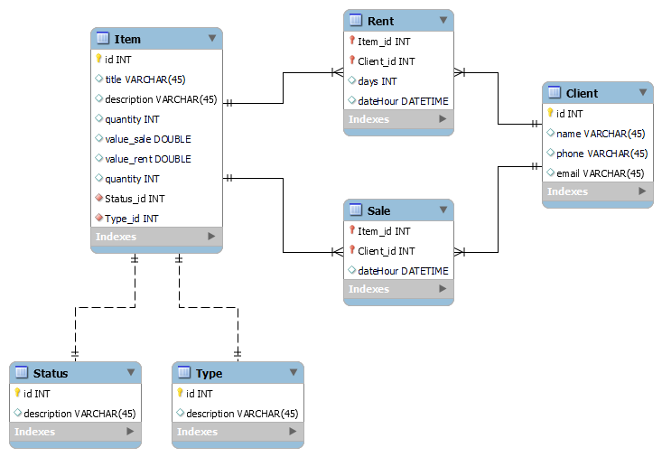

# Projeto Filmoon

### Tempo gasto no desenvolvimento: 10 Horas

Esquema do Banco de Dados


## Como executar?

- Altere as informações de acesso ao banco no arquivo `application.properties` (usuario e senha);
- Execute o arquivo `src/main/resources/filmoon.sql` para a criação das tabelas e inserção de alguns dados para teste;

Instale as dependências com o mvn:

```bash
mvn clean dependency:resolve
mvn spring-boot:run
```

A API está documentada com o Swagger. Ao acessar http://localhost:8080/swagger-ui/ será possível visualizar e testar os
endpoint's

<hr/>

### Informações Importantes

- As tabelas auxiliares (Status e Type) já são criadas com valores, para que quando o usuário for inserir algum item,
  seja possível passar apenas o ID do campo requerido. Segue os índices:

## Tabela Status

| Status_id | Descrição    |
| ----------| ------------ |
| 1         | NOT_AVAILABLE |
| 2         | SALE |
| 3         | RENT |
| 4         | ALL |

## Tabela Type

| Type_id | Descrição    |
| ----------| ------------ |
| 1         | MOVIE |
| 2         | BOOK |
| 3         | TV_SHOW |

Ao passar esses campos para criar um Item, pode ser passado apenas o ID do campo.


